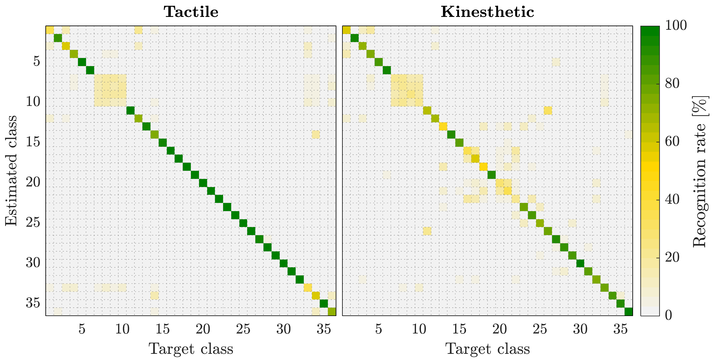

# LSTM-Haptic-Fusion

## Abstract
Recent advances in the field of intelligent robotic manipulation pursue providing  robotic  hands  with  touch  sensitivity.  Haptic  perception  encompasses  the  sensing  modalities  encountered  in  thesense  of  touch  (e.g.,  tactile  and  kinesthetic  sensations).  This letter  focuses  on  multimodal  object  recognition  and  proposes a   Bayesian   methodology   for   the   optimal   fusion   of   tactile-and  kinesthetic-based  classification  results.  The  procedure  is as  follows:  a  three-finger  actuated  gripper  with  an  integrated high-resolution tactile sensor performs squeeze-and-release Ex-ploratory Procedures (EPs). The tactile images and kinesthetic information acquired using angular sensors on the finger joints constitute  the  time-series  datasets  of  interest.  Each  temporal dataset  is  fed  to  a  Long  Short-term  Memory  (LSTM)  NeuralNetwork,  which  is  trained  to  classify  in-hand  objects.  TheLSTMs   provide   an   estimation   of   the   posterior   probability of  each  object  given  the  corresponding  measurements,  which after  fusion  allows  to  estimate  the  object  through  maximum  aposteriori  (MAP).  An  experiment  with  36-classes  is  carried out  to  evaluate  and  compare  the  performance  of  the  fused, tactile,  and  kinesthetic  perception  systems.  The  results  show that the fusion-based algorithm improves capabilities for object-recognition.

## Dataset
The dataset is divided into two parts: kinesthetic and tactile data. This dataset is formed by 36 objects, which has been divided into three subgroups, depending on their internal characteristics.

* **Rigid Objects**

These objects are considered as rigid due to they barely change their shape when the gripper tightens them.

* **Deformable Objects**

Deformable objects change substantially his initial shape when pressure is applied over them, but they recover its initial shape when the pressure ends.

* **In-bag Objects**

 The last group is composed of plastic bags with a number of small rigid objects. Bags are shuffled before every grasp so that the objects in the bag are placed in different positions.

## Data colection procedure
An example of how the dataset of the group of objects has been collected is presented in the video: 

The image shows the evolution of both tactile and kinesthetic data over time whenever a squeeze-and-release is made.

## Training ##

### LSTM Networks ###

To train the NLSTM Networks, download the dataset, change the "FUSION2020_FOLDER_PATH" to your path and choose the number of objects for training. Execute all cells in order to get the following data:

* **Output Matrix.** An output matrix is created with the probabilities obtained testing the neural network.
* **Data visualization.** A visualization of the data previously loaded. Tactile data is represented as 21 images and kinesthetic as a 4x41 matrix.
* **Accuracy and loss.** The loss and accuracy of the training and validation set are represented over the epochs.

### Neural Fusion ###
 To train the neural fusion network, both LSTMs Output matrix must be in the path. Introduce the number of objects previously trained and the number of training objects for the perceptron. Again execute all cells to get the following data: 

* **Output Matrix.** An output matrix is created with the probabilities obtained testing the perceptron.
* **Accuracy and loss.** The loss and accuracy of the training and validation set is represented over the epochs.

### Bayesian Inference ###

Finally, to train the Bayesian Inference classification, the three output matrixes must be in the path. The number of objects trained individually in the LSTM networks has to match with the number of objects pretrained as an input plus the number of training objects for the perceptron. In other words, output matrixes must have the same size, which means they have been tested with the same group of objects. The output of this program are the probabilities of each network and his confusion matrix:

## Cite this work

 Francisco Pastor, Jorge Garcıa-Gonzalez, Juan M. Gandarias, Daniel Medina, Alfonso J. Garcıa-Cerezo, Jesus M. Gomez-de-Gabriel, "Bayesian  and  Neural  Inference  on  LSTM-based  Object  Recognitionfrom  Tactile  and  Kinesthetic  Information"
